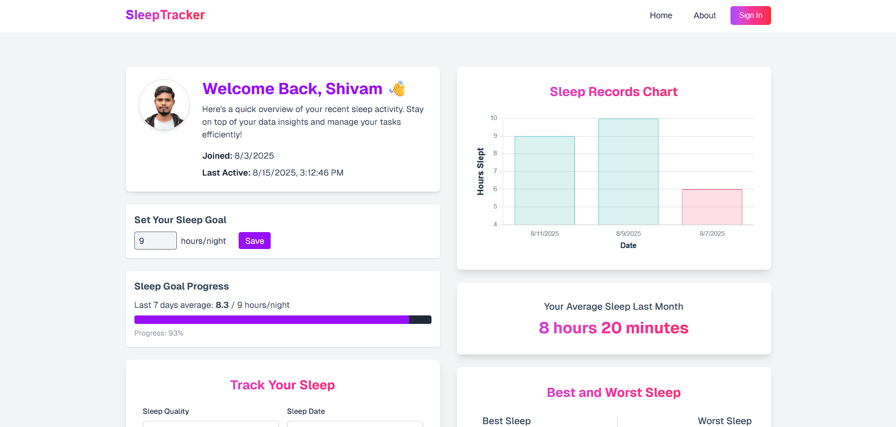

<div align="center">
  
</div>
<br/>

 # 😴 Sleep Tracker

A modern sleep tracking web application built with Next.js 15, featuring real-time analytics, personalized insights, and comprehensive sleep data visualization.


## ✨ Features

### 📊 Sleep Analytics

- **Sleep Duration Tracking**: Record and monitor your daily sleep hours
- **Visual Charts**: Beautiful data visualizations using Chart.js
- **Best & Worst Sleep Analysis**: Track your sleep patterns and extremes
- **Average Sleep Calculation**: Get insights into your sleep habits

### 💼 Core Functionality

- **Sleep Record Management**: Add, edit, and delete sleep entries with ease
- **Creating Sleep Goal**: User can set sleep goal and check the status
- **Real-time Statistics**: Comprehensive sleep analytics dashboard
- **Sleep History**: Complete sleep record history with search and filter
- **Date-based Tracking**: Track sleep patterns over time

### Installation

1. **Clone the repository**

   ```bash
   git clone https://github.com/sahandghavidel/sleep-tracker-next.git
   cd sleep-tracker-next
   ```

2. **Install dependencies**

   ```bash
   npm install
   # or
   yarn install
   # or
   pnpm install
   ```

3. **Set up environment variables**
   Create a `.env` file in the root directory:

   ```bash
   # Database
   DATABASE_URL="your-neon-database-url"

   # Clerk Authentication
   NEXT_PUBLIC_CLERK_PUBLISHABLE_KEY="your-clerk-publishable-key"
   CLERK_SECRET_KEY="your-clerk-secret-key"
   NEXT_PUBLIC_CLERK_SIGN_IN_URL="/sign-in"
   NEXT_PUBLIC_CLERK_SIGN_UP_URL="/sign-up"
   NEXT_PUBLIC_CLERK_SIGN_IN_FALLBACK_REDIRECT_URL="/"
   NEXT_PUBLIC_CLERK_SIGN_UP_FALLBACK_REDIRECT_URL="/"

   # App URL
   NEXT_PUBLIC_APP_URL="http://localhost:3000"
   ```

4. **Set up the database**

   ```bash
   npx prisma generate
   npx prisma db push
   ```

5. **Run the development server**

   ```bash
   npm run dev
   # or
   yarn dev
   # or
   pnpm dev
   ```

6. **Open your browser**
   Navigate to [http://localhost:3000](http://localhost:3000)